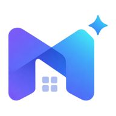
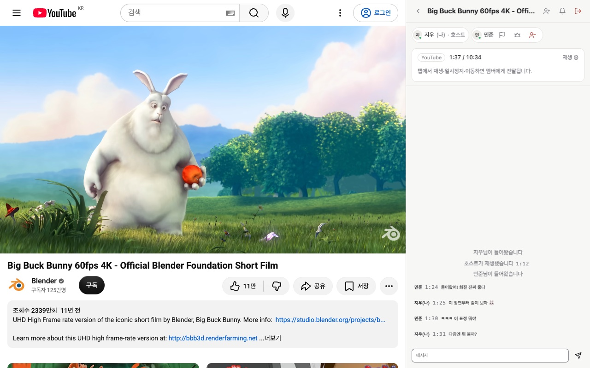
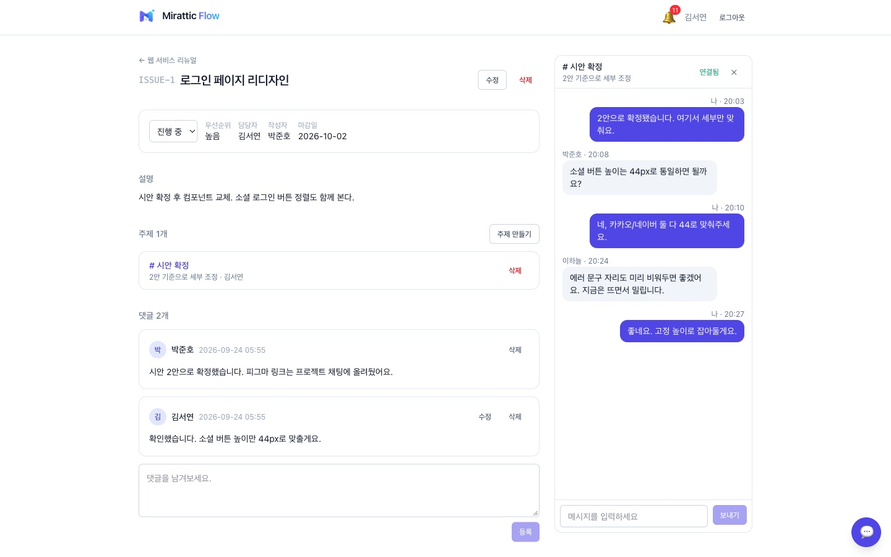

  

<h1 align="center">함께 보고, 함께 일하는 곳.</h1>

  Mirattic은 친구와 영상을 같은 순간에 보는 <b>Mirattic Sync</b>와, 
  팀이 이슈와 대화를 한곳에서 나누는 <b>Mirattic Flow</b>를 만듭니다. 
  계정 하나로 둘 다 씁니다.

  <a href="https://sync.mirattic.com"> Mirattic Sync</a>
  &nbsp;·&nbsp;
  <a href="https://flow.mirattic.com"> Mirattic Flow</a>
  &nbsp;·&nbsp;
  <a href="https://auth.mirattic.com"> 내 계정</a>

---

##  Mirattic Sync

### 친구랑 같은 영상을 같은 초에 보세요.

- **방장이 재생하면 모두 재생** — 멈추고 넘기는 것도 모두의 화면이 따라갑니다.
- **영상은 각자 브라우저에서** — 녹화하거나 중계하지 않습니다.
- **옆 패널에서 대화** — 영상을 가리지 않는 사이드 패널에서 이야기합니다.

|  YouTube |  Netflix |  라프텔 |
|:---:|:---:|:---:|
| 지원 | 실험 | 실험 |

**[Sync 살펴보기 →](https://sync.mirattic.com)**

---

##  Mirattic Flow

### 이슈와 대화를 한 화면에서.

- **워크스페이스 · 프로젝트 · 이슈** — 담당자, 우선순위, 마감일, 상태를 한눈에.
- **이슈 옆 실시간 채팅** — 이야기한 내용이 그 이슈에 남습니다.
- **알림과 대시보드** — 내 담당과 진행 상황을 놓치지 않습니다.

**[Flow 시작하기 →](https://flow.mirattic.com)**

---

##  Mirattic 계정

### 계정 하나로 모두.

- 이메일, 카카오, 네이버 중 편한 방법으로 가입하고 로그인합니다. Sync와 Flow에 같은 계정으로 들어갑니다.
- 비밀번호는 Mirattic 계정에서만 입력합니다. 각 서비스는 비밀번호를 받지도, 저장하지도 않습니다.
- 로그인된 기기, 최근 보안 활동, 탈퇴까지 **[내 계정](https://auth.mirattic.com)** 에서 직접 관리합니다.

---

이 저장소에 대하여

[mirattic.com](https://mirattic.com) 소개 페이지의 소스입니다.

- 빌드 없는 정적 페이지: `public/` (`index.html` + `assets/`). 이 폴더만 공개됩니다
- 배포: `main` 에 push → GitHub Actions 가 호스트에 SSH → `deploy/deploy.sh` 가 `public/` 을 호스트 Caddy 의 루트로 복사.
  CI 키는 호스트에서 이 스크립트만 실행할 수 있습니다
- 로컬 미리보기: `python3 -m http.server 8765 -d public` → http://127.0.0.1:8765

© 2026 Mirattic

